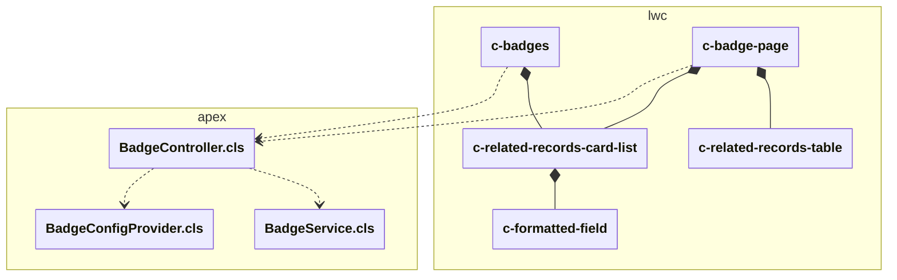
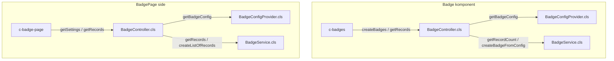

# Badges løsningsoversikt

Badge-løsningen viser "badges" på en Salesforce-record. Den består av:

-   LWC-komponenter for visning og interaksjon:

    -   `badges` (Viser badges. Kan legges på en record page)
    -   `badgePage` (Egen side som viser relaterte records for en valgt badge)
    -   `relatedRecordsCardList` (Detaljvisning som tiles)
    -   `formattedField` (Støttekomponent for formatering)
    -   `relatedRecordsTable` (Detaljvisning som tabell)

-   Apex-klasser for generering og henting av data:

    -   `BadgeController.cls` (Eksponerer metoder for LWC)
    -   `BadgeService.cls` (Inneholder logikk for å generere badges og hente relaterte records)
    -   `BadgeConfigProvider.cls` (Inneholder statisk konfigurasjon)

# Klasser og komponenter

-   `BadgeController.cls`
    -   `createBadges(Id recordId, String keys): List<Badge>`: Tar en record Id og string med flere badge keys som input. For hver badge key hentes config Map fra `BadgeConfigProvider`, og deretter brukes `BadgeService` for å hente data og lage badges.
    -   `getRecords(Id recordId, String badgeType): List<Record>`: Tar en record Id og string med en badge key som input og henter matchende records. Brukes ved badge hover og i badgePage.
    -   `getSettings(String badgeType): Map<String, String>`: Tar en badge key som input og returnerer map med settings fra `BadgeConfigProvider`.
-   `BadgeService.cls`
    -   `createBadgeFromConfig(Id recordId, String keys): List<Badge>`
    -   `getRecords(Id recordId, String badgeType): List<BadgeRecord>`
    -   `getRecordCount(...), createBadgeFromConfig(...), createListOfRecords(...), etc.`
    -   `Wrapper-klasser`
-   `<c-badges>`
    -   Kaller BadgeController.createBadges(recordId, keys) for hente badge-objekter (keys er en property).
    -   Håndterer visning og åpning av popover. Ved popover kalles getRecords() for å hente relaterte data for en badge.
-   `<c-badge-page>`
    -   Henter recordId og badge fra url og kaller BadgeController.getSettings for øvrige parametere.
    -   Kaller BadgeController.getRecords(recordId, badgeType) for å hente relaterte records.
    -   Bruker c-related-records-table (desktop) og c-related-records-card-list(mobil) for visualisering.

## Tilgjengelighet og UX

Popover kan trigges via tab-navigasjon. Escape og tab-navigasjon håndteres eksplisitt. Fokus returneres til trigger-knapp ved lukking.
Fokusfelle (focus trap) i popover er ikke implementert.
